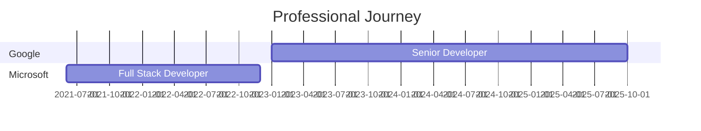
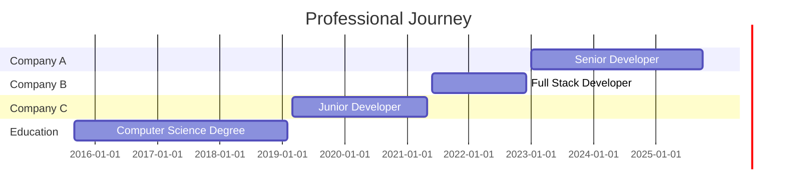
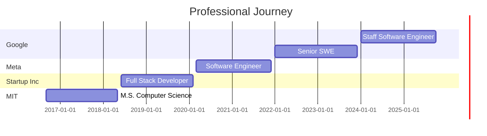

# 📚 GitHub Profile Setup Guide

Complete step-by-step instructions to set up your amazing GitHub profile!

---

## 📋 Table of Contents

- [Prerequisites](#prerequisites)
- [Quick Start](#quick-start)
- [Detailed Setup](#detailed-setup)
- [Customization Guide](#customization-guide)
- [Dynamic Features Setup](#dynamic-features-setup)
- [Optional Enhancements](#optional-enhancements)
- [Theme Customization](#theme-customization)
- [Troubleshooting](#troubleshooting)
- [Best Practices](#best-practices)
- [Maintenance](#maintenance)

---

## ✅ Prerequisites

Before you start, make sure you have:

- A GitHub account
- Basic knowledge of Markdown
- Git installed on your computer (optional but recommended)

---

## 🚀 Quick Start

### Step 1: Create Your Profile Repository

1. Go to [GitHub](https://github.com)
2. Click the `+` icon in the top right corner
3. Select **New repository**
4. **IMPORTANT:** Name the repository **exactly** as your GitHub username
   - Example: If your username is `johndoe`, name the repository `johndoe`
5. Make it **Public**
6. Check **Add a README file**
7. Click **Create repository**

### Step 2: Add the Template

1. Open the `github-profile-README.md` file from this package
2. Copy all the content
3. Go to your profile repository on GitHub
4. Click on the `README.md` file
5. Click the pencil icon (Edit this file)
6. Replace all content with the template
7. Scroll down and click **Commit changes**

### Step 3: Customize Your Profile

Replace all the placeholders with your information (see [Customization Guide](#customization-guide) below).

---

## 🔧 Detailed Setup

### Creating the Profile Repository

Your GitHub profile README is a special repository that displays on your profile page. Here's how to create it:

```bash
# Using Git CLI (alternative method)
git clone https://github.com/YOUR_USERNAME/YOUR_USERNAME.git
cd YOUR_USERNAME
cp path/to/github-profile-README.md README.md
git add README.md
git commit -m "Add awesome profile README"
git push origin main
```

### Repository Settings

1. **Repository name:** Must match your GitHub username exactly
2. **Visibility:** Must be Public
3. **Description:** Add a catchy description like "My awesome GitHub profile ✨"

---

## 🎨 Customization Guide

### Placeholder Replacement Table

Replace all these placeholders in the template with your actual information:

| Placeholder | Description | Example |
|-------------|-------------|---------|
| `YOUR_NAME` | Your full name | John Doe |
| `YOUR_USERNAME` | Your GitHub username | johndoe |
| `YOUR_LINKEDIN` | LinkedIn username | johndoe |
| `YOUR_TWITTER` | Twitter/X username | johndoe |
| `YOUR_EMAIL` | Your email address | john@example.com |
| `YOUR_PORTFOLIO_URL` | Your portfolio website | https://johndoe.com |
| `YOUR_CITY` | Your city | San Francisco |
| `YOUR_COUNTRY` | Your country | USA |
| `YOUR_BLOG_URL` | Your blog URL | https://blog.johndoe.com |
| `YOUR_DEVTO` | Dev.to username | johndoe |
| `YOUR_MEDIUM` | Medium username | johndoe |
| `YOUR_SPOTIFY_USER` | Spotify user ID | (see Spotify section) |
| `PROJECT_1`, `PROJECT_2`, etc. | Your repository names | awesome-project |

### Quick Replace Method

Use your text editor's find & replace feature:

1. Open the README.md in your favorite editor
2. Use Find & Replace (Ctrl+H or Cmd+H)
3. Find: `YOUR_USERNAME` → Replace with: `youractualusername`
4. Repeat for all placeholders

### Section-by-Section Customization

#### 1. Typing Animation Header

```markdown
[](https://git.io/typing-svg)
```

**Customize:**
- Replace `YOUR_NAME` with your actual name
- Change the text after `lines=` to your own messages
- Separate multiple lines with `;`
- Use `%20` for spaces, `%2C` for commas, `%F0%9F%91%8B` for emojis (URL encoded)

**Advanced customization:**
- `font=` - Change font (options: Fira+Code, Roboto, etc.)
- `size=` - Text size (default: 32)
- `color=` - Text color (hex code without #)
- `duration=` - Typing speed in milliseconds

#### 2. About Me Section

Update the TypeScript code block with your information:

```typescript
const YOUR_NAME = {
    pronouns: "He" | "Him",  // Your pronouns
    location: "YOUR_CITY, YOUR_COUNTRY",  // Your location
    code: ["TypeScript", "JavaScript", "Python"],  // Languages you know
    askMeAbout: ["web dev", "cloud"],  // Your expertise
    // ... update all fields
};
```

#### 3. Tech Stack Badges

Keep only the technologies you actually use. Remove badges you don't need:

```markdown
<!-- Keep this badge -->


<!-- Remove this badge if you don't use Angular -->
<!--  -->
```

#### 4. GitHub Statistics

Replace `YOUR_USERNAME` with your GitHub username in these URLs:

- GitHub Stats: `https://github-readme-stats.vercel.app/api?username=YOUR_USERNAME...`
- Streak Stats: `https://github-readme-streak-stats.herokuapp.com/?user=YOUR_USERNAME...`
- Top Languages: `https://github-readme-stats.vercel.app/api/top-langs/?username=YOUR_USERNAME...`

#### 5. Featured Projects

Replace `PROJECT_1`, `PROJECT_2`, etc. with your actual repository names:

```markdown
[](https://github.com/YOUR_USERNAME/awesome-project)
```

#### 6. Work Experience Timeline

Update the Mermaid diagram with your actual work history:



---

## ⚡ Dynamic Features Setup

### 1. Visitor Counter

Already configured! Just replace `YOUR_USERNAME`:

```markdown

```

**Alternative counters:**
```markdown

```

### 2. GitHub Stats

Using [github-readme-stats](https://github.com/anuraghazra/github-readme-stats):

```markdown

```

**Parameters:**
- `show_icons=true` - Show icons
- `theme=tokyonight` - Color theme
- `include_all_commits=true` - Count all commits
- `count_private=true` - Include private repos

### 3. Streak Stats

Using [github-readme-streak-stats](https://github.com/DenverCoder1/github-readme-streak-stats):

```markdown

```

### 4. Activity Graph

Using [github-readme-activity-graph](https://github.com/Ashutosh00710/github-readme-activity-graph):

```markdown
[](https://github.com/ashutosh00710/github-readme-activity-graph)
```

---

## 🔗 Professional Integration Features

### LinkedIn Integration (Highly Recommended)

Connecting your GitHub profile with LinkedIn creates a powerful professional presence that significantly boosts visibility and credibility.

#### Why LinkedIn + GitHub Integration Matters

1. **3-5x Increase in Profile Views:** Recruiters and developers discover you on both platforms
2. **Credibility Boost:** Your code validates your skills and experience
3. **Network Effect:** LinkedIn connections discover your GitHub work
4. **Career Opportunities:** More inbound job offers and collaboration requests

#### Step-by-Step LinkedIn Integration

**1. Add LinkedIn Badge to GitHub Profile**

In your `README.md`, the LinkedIn badge is already included:

```markdown
[](https://linkedin.com/in/YOUR_LINKEDIN)
```

Replace `YOUR_LINKEDIN` with your LinkedIn username (the part after `linkedin.com/in/`).

**Example:** If your LinkedIn URL is `https://linkedin.com/in/jane-developer`, use `jane-developer`.

**2. Add GitHub to Your LinkedIn Profile**

Method 1 - Featured Section (Most Visible):
1. Go to your LinkedIn profile
2. Click **Add profile section** → **Recommended** → **Featured**
3. Click the **+** button
4. Select **Add link**
5. Enter your GitHub profile URL: `https://github.com/YOUR_USERNAME`
6. Add a compelling title and description:
   ```
   Title: My Open Source Work on GitHub
   Description: Explore my code repositories, open source contributions, and
   technical projects. Featuring work in [Your Primary Technologies] with
   [X] stars across repositories.
   ```

Method 2 - Contact Info Section:
1. Click **Contact info** on your LinkedIn profile
2. Scroll to **Websites**
3. Select **Other** from the dropdown
4. Enter label: "GitHub Profile"
5. Enter URL: `https://github.com/YOUR_USERNAME`

Method 3 - Experience Descriptions:
Include GitHub repository links in your job descriptions:
```
Led development of internal API platform.
🔗 View code: github.com/yourcompany/api-platform
```

**3. Optimize Your LinkedIn Headline**

Update your LinkedIn headline to drive traffic to GitHub:

**Examples:**
- "Full Stack Developer | 500+ GitHub Stars | Building in Public"
- "Senior Software Engineer @ Company | Open Source Contributor | github.com/username"
- "Tech Lead | 100+ Public Repositories | Passionate about Clean Code"
- "Software Architect | Check out my GitHub for real-world examples"

**4. Cross-Promote Strategically**

**On LinkedIn Posts:**
- Share when you launch new projects: "Just released [Project]! Check it out on GitHub: [link]"
- Celebrate milestones: "Grateful to hit 1,000 GitHub stars! Here's what I learned..."
- Write articles about your code: "How I built [X] - see the code on GitHub"
- Add GitHub links in first comment for better engagement

**In Your LinkedIn About Section:**
```
💻 Passionate software developer specializing in [Your Stack]

🔨 I build in public - check out my work:
   GitHub: github.com/YOUR_USERNAME

⭐ Notable projects:
   • [Project 1] - [Brief description] ([X] stars)
   • [Project 2] - [Brief description] ([X] stars)

📊 Stats:
   • [X]+ open source contributions
   • [X]+ GitHub stars
   • [X]+ public repositories
```

**5. Measure Your Impact**

Track these metrics monthly:
- LinkedIn profile views (check LinkedIn Analytics)
- GitHub profile views from LinkedIn (use UTM parameters)
- Connection requests mentioning your GitHub
- InMail messages about your projects

**Pro Tips:**
- Update both profiles simultaneously when adding new skills
- Pin your best GitHub project to LinkedIn Featured section
- Respond to comments on LinkedIn posts about your code
- Join LinkedIn groups related to your GitHub focus areas
- Share GitHub achievements (100 stars, 1000 commits, etc.)

---

### Personal Blog Integration (Optional but Impactful)

Adding your personal blog creates additional pathways for discovery and establishes thought leadership.

#### Why Add Your Blog?

1. **Authority Building:** Positions you as an expert in your field
2. **SEO Benefits:** Multiple channels drive traffic to your GitHub
3. **Content Marketing:** Blog → GitHub traffic conversion
4. **Career Opportunities:** Demonstrates communication skills

#### Blog Integration Options

**Option 1: Auto-Update Blog Posts (Recommended)**

This automatically pulls your latest blog posts into your GitHub profile.

**Supported Platforms:**
- Dev.to
- Medium
- Hashnode
- WordPress
- Ghost
- Custom RSS feeds

**Setup Steps:**

1. **Add Blog Section to README.md**

Your template already includes:

```markdown
## 📝 Latest Blog Posts

<!-- BLOG-POST-LIST:START -->
<!-- BLOG-POST-LIST:END -->

➡️ [More blog posts...](https://YOUR_BLOG_URL)
```

Replace `YOUR_BLOG_URL` with your actual blog URL.

2. **Set Up GitHub Actions Workflow**

See detailed instructions in `GITHUB-ACTIONS-GUIDE.md` (Workflow 1: Blog Posts Auto-Update).

Quick setup:
- Create `.github/workflows/blog-post-workflow.yml`
- Configure your RSS feed URL
- Runs automatically daily to fetch latest posts

3. **Test the Integration**

After setup:
- Manually trigger the workflow: Actions tab → Blog post workflow → Run workflow
- Check if posts appear in your README.md
- Verify links work correctly

**Option 2: Manual Blog Section**

If you prefer manual control or don't have an RSS feed:

```markdown
## 📝 Featured Writing

### Technical Articles

📰 [Building Scalable Microservices with Node.js](https://yourblog.com/microservices-nodejs)
   *15K views • 10 min read • Published Mar 2025*
   Learn how to architect microservices for scale using Node.js and Docker.

📰 [Advanced TypeScript Patterns for Large Codebases](https://yourblog.com/typescript-patterns)
   *12K views • 15 min read • Published Feb 2025*
   Deep dive into advanced TypeScript patterns with real-world examples.

📰 [My Journey to Senior Developer](https://yourblog.com/journey-to-senior)
   *8K views • 8 min read • Published Jan 2025*
   Lessons learned and advice for developers advancing their careers.

### Tutorial Series

🎓 [Complete REST API Guide](https://yourblog.com/rest-api-series) - 5-part series
🎓 [React Performance Optimization](https://yourblog.com/react-perf) - 3-part series

➡️ [View all articles on my blog](https://YOUR_BLOG_URL)
```

**Option 3: Blog Badge Section**

Add blog badges to your social media section:

```markdown
[](https://YOUR_BLOG_URL)
[](https://dev.to/YOUR_DEVTO)
[](https://hashnode.com/@YOUR_HASHNODE)
```

**Replace:**
- `YOUR_BLOG_URL` - Your blog's homepage URL
- `YOUR_DEVTO` - Your Dev.to username
- `YOUR_HASHNODE` - Your Hashnode username

#### Content Strategy for Maximum GitHub Traffic

**Blog Topics That Drive GitHub Visits:**

1. **Project Showcases:** "How I Built [Project Name]"
   - Include architecture diagrams
   - Link to GitHub repository throughout
   - Add "View the code" CTAs

2. **Technical Tutorials:** "Step-by-Step Guide to [Technology]"
   - Provide code examples from your repos
   - Link to complete implementations on GitHub
   - Include runnable demo repositories

3. **Case Studies:** "Solving [Problem] with [Solution]"
   - Detail your approach with code samples
   - Reference specific GitHub commits
   - Link to before/after comparisons

4. **Best Practices:** "[X] Patterns for Better [Technology]"
   - Use examples from your production code
   - Link to GitHub repositories demonstrating patterns
   - Provide starter templates

5. **Career & Learning:** "What I Learned Building [X]"
   - Share code examples and repositories
   - Link to projects mentioned
   - Provide learning resources (your repos)

**Cross-Promotion Best Practices:**

**In Blog Posts:**
- Link to GitHub repos in first paragraph
- Add "View the complete code on GitHub" sections
- Include GitHub badges showing stars/forks
- Embed GitHub Gists for code snippets
- End with "Star the repo if you found this useful!"

**In GitHub READMEs:**
- Reference blog posts for detailed explanations
- Add "📝 Read the full story: [Blog Post Title]" links
- Include blog post badges showing view counts
- Create dedicated "Articles" section in major repos

**Measuring Blog → GitHub Impact:**

Use UTM parameters to track traffic:

```
https://github.com/YOUR_USERNAME?utm_source=blog&utm_medium=article&utm_campaign=project_launch
```

Track in Google Analytics:
- Source/Medium: blog/article
- Campaign: project_launch
- Conversions: GitHub follows, stars, forks

---

### Medium Integration (Optional - For Extended Reach)

Medium provides access to 100M+ monthly readers without requiring your own audience.

#### Why Add Medium?

1. **Massive Reach:** Built-in audience of developers and tech professionals
2. **Discoverability:** Medium's algorithm surfaces quality content
3. **Publications:** Join established publications (Towards Data Science, Better Programming, etc.)
4. **Credibility:** Associated with high-quality technical writing
5. **SEO Benefits:** Medium articles rank well in Google

#### Medium + GitHub Integration Strategy

**1. Set Up Medium Profile**

1. Create account at [medium.com](https://medium.com)
2. Set up your profile:
   - Professional photo (same as GitHub/LinkedIn for consistency)
   - Compelling bio mentioning your GitHub:
     ```
     Software Developer | Open Source Contributor

     I write about [Your Topics] and build in public.

     🔨 Check out my code: github.com/YOUR_USERNAME
     ⭐ [X]+ GitHub stars • [X]+ contributions

     Follow for articles about [Your Focus Areas]
     ```
3. Add GitHub link to profile (appears under bio)

**2. Add Medium Badge to GitHub Profile**

Your template includes:

```markdown
[](https://medium.com/@YOUR_MEDIUM)
```

Replace `YOUR_MEDIUM` with your Medium username.

**3. Auto-Update Medium Articles in GitHub Profile**

**Setup Instructions:**

Add to your README.md:

```markdown
## ✍️ Latest on Medium

<!-- MEDIUM-POST-LIST:START -->
<!-- MEDIUM-POST-LIST:END -->

➡️ [Read more on Medium](https://medium.com/@YOUR_MEDIUM)
```

Then configure GitHub Actions (see `GITHUB-ACTIONS-GUIDE.md`):

```yaml
- uses: gautamkrishnar/blog-post-workflow@v1
  with:
    feed_list: "https://medium.com/feed/@YOUR_MEDIUM"
    comment_tag_name: "MEDIUM-POST-LIST"
```

**4. Medium Article Structure for GitHub Traffic**

**Optimal Article Format:**

1. **Compelling Title** (Include tech stack)
   - ✅ "Building a Real-Time Chat App with Node.js and WebSockets"
   - ❌ "My Latest Project"

2. **Strong Opening** (Hook + GitHub link)
   ```
   I recently built a real-time chat application that handles 10,000+
   concurrent connections. In this article, I'll walk you through the
   architecture and key decisions.

   🔗 Full source code on GitHub: github.com/username/chat-app
   ⭐ Star the repo if you find it useful!
   ```

3. **Visual Content**
   - Architecture diagrams
   - Screenshots of your GitHub repo
   - Code snippets (use GitHub Gists and embed them)
   - Demo GIFs from your repository

4. **Code Examples with GitHub Context**
   ```javascript
   // From: github.com/username/project/blob/main/server.js

   const server = createServer();
   // ... your code
   ```

5. **Strong Conclusion with CTA**
   ```
   ## Try It Yourself

   Ready to implement this? The complete codebase is available on GitHub:

   ⭐ Star: github.com/username/chat-app
   🍴 Fork: github.com/username/chat-app/fork
   📖 Documentation: github.com/username/chat-app#readme

   Found this helpful? Follow me on GitHub for more projects!
   ```

**5. Cross-Promotion Strategy**

**On Medium:**
- Add GitHub logo/badge in article headers
- Reference specific files: "See `server.js` on GitHub"
- Include commit SHAs for specific implementations
- Link to Issues/Discussions for questions
- Mention GitHub stars/forks as social proof

**On GitHub:**
- Add "Featured on Medium" badges to READMEs:
  ```markdown
  [](https://medium.com/@username/article-url)
  ```
- Create "Articles" section in repository README
- Reference Medium articles in documentation
- Link to Medium profile in main profile README

**On LinkedIn:**
- Share Medium articles with GitHub repository links
- Comment with GitHub repo link after posting article
- Create carousel posts featuring article + code snippets

**6. Medium Publication Strategy**

**Target Publications by Tech Stack:**

**General Software Development:**
- [Better Programming](https://betterprogramming.pub)
- [Level Up Coding](https://levelup.gitconnected.com)
- [The Startup](https://medium.com/swlh)
- [CodeX](https://medium.com/codex)

**Data Science/AI:**
- [Towards Data Science](https://towardsdatascience.com)
- [Analytics Vidhya](https://medium.com/analytics-vidhya)
- [The Startup (AI)](https://medium.com/swlh)

**Cloud/DevOps:**
- [ITNEXT](https://itnext.io)
- [Cloud Native Daily](https://medium.com/cloud-native-daily)

**JavaScript/Frontend:**
- [JavaScript in Plain English](https://javascript.plainenglish.io)
- [Frontend Weekly](https://medium.com/frontend-weekly)

**How to Get Published:**
1. Read publication guidelines (usually in publication "About" section)
2. Write high-quality, original content (1000-2000 words)
3. Submit draft for review (button appears in editor)
4. Include compelling images and code examples
5. Link to your GitHub repositories for credibility

**Benefits of Publications:**
- 10-100x larger audience reach
- Higher chance of curation (Medium's homepage feature)
- Association with respected brands
- More followers and engagement
- Better SEO and discoverability

**7. Measure Medium → GitHub Impact**

**Track These Metrics:**

```
Weekly Tracking Spreadsheet:

| Date | Medium Views | Medium Reads | GitHub Stars (Week) | GitHub Traffic from Medium |
|------|--------------|--------------|---------------------|---------------------------|
| Week 1 | 500 | 200 | +15 | 45 visits |
| Week 2 | 1200 | 450 | +42 | 120 visits |
```

**Use UTM Parameters:**
```
github.com/username/project?utm_source=medium&utm_medium=article&utm_campaign=chat_app_tutorial
```

**Medium Stats to Monitor:**
- Article views
- Read ratio (reads / views)
- Fans (claps from unique users)
- Referrals to GitHub (check GitHub Insights → Traffic → Referring sites)

**Expected Results (3 Months):**
- Medium followers: 100-500
- Article views: 5,000-20,000
- GitHub traffic from Medium: 200-1,000 visits
- Repository stars from articles: 50-200

#### Medium Writing Cadence

**Recommended Schedule:**

**Beginners (Building Audience):**
- 2-4 articles per month
- Focus on tutorials and how-tos
- Link every article to GitHub repositories

**Intermediate (Growing Audience):**
- 4-8 articles per month
- Mix tutorials, case studies, and thought leadership
- Experiment with publication submissions

**Advanced (Established Audience):**
- 8+ articles per month
- Series and in-depth guides
- Guest posts and collaboration articles

**Pro Tips:**
- Publish on weekday mornings (8-11 AM EST) for best reach
- Use 5-7 relevant tags (first tag = primary topic)
- Include at least one image every 3-4 paragraphs
- Respond to comments and engage with readers
- Share on Twitter, LinkedIn within 24 hours of publishing

---

### Work Experience & Employer Showcase (Optional - Highly Professional)

Displaying your work history visually adds credibility and context to your GitHub profile.

#### Why Showcase Work Experience?

1. **Professional Context:** Helps recruiters understand your background
2. **Career Trajectory:** Shows growth and progression
3. **Credibility:** Real companies validate your experience
4. **Relevance:** Links current role to GitHub projects

#### Option 1: Mermaid Gantt Chart Timeline (Already in Template)

Your template includes a professional timeline using Mermaid diagrams:

```markdown
## 💼 Work Experience


```

**Customization Instructions:**

1. **Update Company Names:** Replace "Company A", "Company B", etc.
   ```mermaid
   section Google
   Senior Software Engineer   :2023-01, 2025-10
   section Microsoft
   Software Engineer II       :2021-06, 2022-12
   ```

2. **Update Job Titles:** Match your actual positions

3. **Update Dates:** Use YYYY-MM format
   - Start date, End date
   - Use current month for ongoing roles: `:2023-01, 2025-10`

4. **Add Multiple Roles at Same Company:**
   ```mermaid
   section Amazon
   Senior SDE                 :2024-01, 2025-10
   SDE II                     :2022-06, 2023-12
   SDE I                      :2020-03, 2022-05
   ```

5. **Include Education:**
   ```mermaid
   section Education
   M.S. Computer Science      :2018-09, 2020-05
   B.S. Software Engineering  :2014-09, 2018-05
   ```

**Complete Example:**



#### Option 2: Detailed Work Experience Section

For more detail, create a comprehensive experience section:

```markdown
## 💼 Professional Experience

### 🏢 Senior Software Engineer @ Google
**📅 January 2023 - Present** | **📍 Mountain View, CA**

Leading development of Cloud Platform features serving 1M+ users.

**Key Achievements:**
- 🚀 Architected microservices platform processing 100M+ requests/day
- 📊 Reduced latency by 40% through optimization initiatives
- 👥 Mentored team of 5 junior engineers

**Technologies:** Go, Kubernetes, GCP, PostgreSQL

**Related GitHub Projects:**
- [cloud-platform-demo](https://github.com/username/cloud-platform-demo) - Open source version of architecture patterns ⭐ 1.2K stars

---

### 🏢 Full Stack Developer @ Microsoft
**📅 June 2021 - December 2022** | **📍 Seattle, WA**

Developed enterprise web applications for Azure portal.

**Key Achievements:**
- ✨ Built React dashboard used by 500K+ developers
- 🎯 Improved performance metrics by 35%
- 🔧 Implemented CI/CD pipelines reducing deployment time by 60%

**Technologies:** React, TypeScript, Node.js, Azure, MongoDB

**Related GitHub Projects:**
- [react-dashboard-template](https://github.com/username/dashboard) - Component library ⭐ 800 stars

---

### 🏢 Junior Developer @ Startup Inc
**📅 March 2019 - May 2021** | **📍 San Francisco, CA**

Full-stack development for SaaS platform in fintech space.

**Key Achievements:**
- 🎨 Developed frontend features in Vue.js
- 🔐 Implemented authentication system
- 📱 Built REST APIs serving mobile applications

**Technologies:** Vue.js, Python, Django, PostgreSQL, AWS

```

#### Option 3: Company Badges & Logos

Visual representation using badges:

```markdown
## 💼 Career Journey

### Current

[](https://www.google.com)
**Senior Software Engineer** • 2023 - Present

### Previous

[](https://www.microsoft.com)
**Full Stack Developer** • 2021 - 2022

[](https://www.amazon.com)
**Software Development Engineer** • 2019 - 2021

### Education

[](https://www.mit.edu)
**M.S. Computer Science** • 2018
```

**Available Company Badges:**

See `BADGE-REFERENCE.md` for 150+ company badges, or create custom ones:

```markdown

```

#### Option 4: Compact Timeline

For a cleaner, more compact look:

```markdown
## 💼 Experience

**2023 - Present** | Senior Software Engineer @ **Google**
   Leading cloud platform development • Go, Kubernetes, GCP

**2021 - 2022** | Full Stack Developer @ **Microsoft**
   Azure portal development • React, TypeScript, Node.js

**2019 - 2021** | Software Engineer @ **Amazon**
   E-commerce platform features • Java, Spring Boot, AWS

**2018** | M.S. Computer Science @ **MIT**
   Specialized in Distributed Systems

```

#### Connecting Work Experience to GitHub Projects

**Best Practices:**

1. **Link Relevant Repositories**
   - Open source versions of work projects
   - Side projects using work technologies
   - Learning projects related to job skills

2. **Showcase Work Technologies**
   - Create demo repositories with tech stack from jobs
   - Build tutorials using work-related tools
   - Contribute to open source projects in your work domain

3. **Demonstrate Growth**
   - Pin projects showing progression
   - Highlight increasing complexity
   - Show evolution of skills over career timeline

4. **Maintain Professionalism**
   - Never share proprietary company code
   - Create clean-room implementations for demos
   - Use generic examples, not company data
   - Respect NDAs and employment agreements

**Example Integration:**

```markdown
## 💼 Work Experience + Open Source

### 🏢 Google (2023 - Present)
**Role:** Senior Software Engineer - Cloud Platform

**Open Source Contributions:**
- [kubernetes/kubernetes](https://github.com/kubernetes/kubernetes) - 15 PRs merged
- [golang/go](https://github.com/golang/go) - Bug fixes and documentation
- [grpc/grpc-go](https://github.com/grpc/grpc-go) - Performance improvements

**Public Projects Using Work Tech:**
- [distributed-cache](https://github.com/username/distributed-cache) ⭐ 2.1K
  Redis-compatible cache built with Go
- [k8s-operator-template](https://github.com/username/k8s-operator) ⭐ 890
  Kubernetes operator scaffolding

---

### 🏢 Microsoft (2021 - 2022)
**Role:** Full Stack Developer - Azure Portal

**Public Projects:**
- [react-component-library](https://github.com/username/react-lib) ⭐ 1.5K
  Reusable React components using TypeScript
- [azure-deployment-templates](https://github.com/username/azure-templates) ⭐ 450
  ARM templates and Terraform configs
```

#### Privacy Considerations

**What to Include:**
- ✅ Company names (if public/well-known)
- ✅ Job titles
- ✅ General responsibilities
- ✅ Public technologies used
- ✅ Aggregated metrics (e.g., "serving 1M users")

**What to Avoid:**
- ❌ Proprietary code or algorithms
- ❌ Internal company metrics or data
- ❌ Confidential projects or initiatives
- ❌ Client/customer information
- ❌ Salary or compensation details
- ❌ Negative comments about employers

**For Stealth Startups or Confidential Roles:**

```markdown
## 💼 Experience

**2024 - Present** | Senior Engineer @ **Stealth Startup**
   Building next-generation [general category] platform
   Technologies: [list only public ones]

**Related Public Work:**
- Research and experimentation repositories
- General technology demonstrations
- Open source contributions
```

#### Measuring Impact

**Track Profile Engagement:**

After adding work experience section:
- Monitor profile view increases
- Track LinkedIn connection requests from recruiters
- Measure employer-related searches finding your profile
- Note InMail/email inquiries about experience

**Expected Results:**
- 20-40% increase in recruiter views
- More relevant job opportunities
- Higher quality connection requests
- Better context for your GitHub projects

---

## 📈 Measurement & Impact Tracking

### Why Measure Your Profile's Impact?

Track concrete data to prove (or disprove) that optimizing your GitHub profile improves:

**a) Visibility:** Profile views, traffic, follower growth, discoverability
**b) Credibility:** Engagement quality, collaboration requests, job opportunities, industry recognition

### Key Metrics to Track

#### 1. Visibility Metrics (Measuring Reach)

**Primary Metrics:**

| Metric | Where to Find It | Target Growth | Measurement Frequency |
|--------|------------------|---------------|----------------------|
| **GitHub Profile Views** | GitHub Insights (100+ views required) | 3-5x in 3 months | Weekly |
| **Unique Visitors** | GitHub Insights | 2-4x in 3 months | Weekly |
| **Follower Count** | Your GitHub profile | 5-10x in 3 months | Daily |
| **Repository Stars** | Individual repos | 3-5x in 3 months | Weekly |
| **Repository Forks** | Individual repos | 2-3x in 3 months | Weekly |
| **Traffic Sources** | GitHub Insights → Traffic | Diversify sources | Monthly |

**How to Access GitHub Insights:**

1. Go to your profile repository: `github.com/YOUR_USERNAME/YOUR_USERNAME`
2. Click **Insights** tab
3. Click **Traffic** in left sidebar
4. View **Views**, **Unique visitors**, **Clones**, **Referring sites**

**Note:** You need at least 100 profile views before GitHub Insights become available.

**Temporary Visitor Counter:**

Until you hit 100 views, use visitor counter badges (already in template):

```markdown

```

**Secondary Visibility Metrics:**

| Metric | Where to Find It | Indicates |
|--------|------------------|-----------|
| LinkedIn Profile Views | LinkedIn Analytics | Cross-platform reach |
| Blog Post Views | Blog analytics | Content reach |
| Medium Article Views | Medium Stats | Publication reach |
| Referring Sites | GitHub Insights | Traffic sources |
| Google Search Appearances | Google Search Console | SEO performance |

#### 2. Credibility Metrics (Measuring Trust & Reputation)

**Primary Metrics:**

| Metric | Where to Track | What It Proves | Target Growth |
|--------|----------------|----------------|---------------|
| **Collaboration Requests** | Email/GitHub Issues | Professional interest | 5-10x increase |
| **Job Opportunities** | Email/LinkedIn InMail | Career credibility | 3-5x increase |
| **Pull Request Reviews Requested** | GitHub notifications | Technical trust | 2-3x increase |
| **Repository Contributors** | Repo insights | Project credibility | New contributors |
| **Mentions/Shoutouts** | Social media | Industry recognition | Track all mentions |
| **Conference/Speaking Invites** | Email | Thought leadership | Track all invites |

**How to Track Credibility Metrics:**

Create a spreadsheet to manually log these events:

```
Date | Type | Source | Details | Follow-up
2025-10-15 | Job Inquiry | LinkedIn | Senior SWE @ Stripe | Interview scheduled
2025-10-18 | Collab Request | GitHub | Fork & improve my tool | Accepted
2025-10-22 | PR Review | Email | Asked to review OSS PR | Completed
```

**Secondary Credibility Metrics:**

| Metric | Measurement | Indicates |
|--------|-------------|-----------|
| Issue Comments Quality | Upvotes/reactions | Technical expertise |
| Pull Request Acceptance Rate | Merged PRs / Total PRs | Code quality |
| Repository Citations | Google Scholar, GitHub | Academic/industry impact |
| Mentions in Blog Posts | Google Alerts | Industry influence |
| Social Media Engagement | Likes, shares, comments | Community standing |

### Setting Up Your Measurement System

#### Step 1: Establish Your Baseline (Week 0)

**Before making any changes**, record these metrics:

**Baseline Measurement Template:**

```markdown
## GitHub Profile Baseline Metrics
Date Recorded: _____________

### Visibility
- [ ] GitHub Profile Views (last 14 days): _______
- [ ] Unique Visitors (last 14 days): _______
- [ ] Total Followers: _______
- [ ] Total Public Repositories: _______
- [ ] Total Stars (all repos combined): _______
- [ ] Total Forks (all repos combined): _______

### Top 3 Repositories
1. Repo: _________ | Stars: _____ | Forks: _____ | Views (14d): _____
2. Repo: _________ | Stars: _____ | Forks: _____ | Views (14d): _____
3. Repo: _________ | Stars: _____ | Forks: _____ | Views (14d): _____

### Traffic Sources (last 14 days)
- Direct: _______ visits
- Search: _______ visits
- LinkedIn: _______ visits
- Twitter/X: _______ visits
- Other: _______ visits

### Cross-Platform Visibility
- [ ] LinkedIn Profile Views (last 90 days): _______
- [ ] LinkedIn Connections: _______
- [ ] Blog Monthly Views: _______ (if applicable)
- [ ] Medium Followers: _______ (if applicable)
- [ ] Twitter/X Followers: _______ (if applicable)

### Credibility (Manual Count)
- [ ] Job inquiries (last 90 days): _______
- [ ] Collaboration requests (last 90 days): _______
- [ ] PR review requests (last 90 days): _______
- [ ] Speaking/writing invitations (last 90 days): _______
- [ ] Technical questions asked (last 30 days): _______

### Notes
What projects am I promoting? _________________________
Current focus area: __________________________________
Time spent on GitHub (hours/week): __________________
```

**Save this baseline!** You'll compare against it to measure impact.

#### Step 2: Implement Profile Improvements

After recording your baseline:

1. ✅ Update GitHub profile README with template
2. ✅ Add LinkedIn integration
3. ✅ Connect blog/Medium (if applicable)
4. ✅ Add work experience section
5. ✅ Set up dynamic features (stats, blog auto-update)
6. ✅ Pin best repositories
7. ✅ Update all repository READMEs

**Record implementation date:** _____________

#### Step 3: Set Up Automated Tracking

**Weekly GitHub Stats Tracking with GitHub Actions:**

Create `.github/workflows/track-stats.yml` in your profile repository:

```yaml
name: Track Profile Stats

on:
  schedule:
    - cron: '0 0 * * 0'  # Every Sunday at midnight
  workflow_dispatch:  # Manual trigger

jobs:
  track:
    runs-on: ubuntu-latest
    steps:
      - name: Checkout
        uses: actions/checkout@v3

      - name: Get GitHub Stats
        run: |
          DATE=$(date +%Y-%m-%d)
          FOLLOWERS=$(curl -s https://api.github.com/users/${{ github.repository_owner }} | jq '.followers')
          REPOS=$(curl -s https://api.github.com/users/${{ github.repository_owner }} | jq '.public_repos')

          echo "$DATE,$FOLLOWERS,$REPOS" >> stats-log.csv

      - name: Commit Stats
        run: |
          git config --local user.email "action@github.com"
          git config --local user.name "GitHub Action"
          git add stats-log.csv
          git commit -m "📊 Update stats - $(date +%Y-%m-%d)" || exit 0
          git push
```

This creates a `stats-log.csv` file tracking:
- Date
- Follower count
- Repository count

**Manual Tracking Spreadsheet:**

Create a Google Sheet or Excel file with these tabs:

**Tab 1: Weekly Metrics**

| Week | Date | Profile Views | Unique Visitors | Followers | Total Stars | LinkedIn Views | Notes |
|------|------|---------------|-----------------|-----------|-------------|----------------|-------|
| 0 (Baseline) | 2025-10-25 | 75 | 45 | 42 | 156 | 180 | Before changes |
| 1 | 2025-11-01 | 95 | 58 | 48 | 175 | 215 | Updated profile |
| 2 | 2025-11-08 | 145 | 89 | 62 | 210 | 290 | LinkedIn post |

**Tab 2: Credibility Events**

| Date | Event Type | Source | Details | Outcome |
|------|-----------|--------|---------|---------|
| 2025-11-03 | Job Inquiry | LinkedIn | Startup CTO reached out | Phone screen |
| 2025-11-05 | Collaboration | GitHub | Developer wants to contribute | Merged PR |

**Tab 3: Traffic Sources**

| Week | Direct | Search | LinkedIn | Twitter | Medium | Other |
|------|--------|--------|----------|---------|--------|-------|
| Baseline | 50 | 10 | 5 | 5 | 0 | 5 |
| Week 1 | 55 | 12 | 15 | 8 | 0 | 5 |
| Week 2 | 65 | 18 | 35 | 15 | 12 | 0 |

#### Step 4: Measurement Checkpoints

**Week 1 (After Implementation)**

Record immediate changes:
- Profile views (last 7 days vs. baseline weekly average)
- New followers
- Any immediate inquiries or feedback

**Expected:** Minimal change (profile needs time to be discovered)

**Week 4 (One Month)**

First significant checkpoint:

```markdown
## 4-Week Checkpoint

### Visibility Growth
- Profile views: ______ (+____% vs baseline)
- Followers: ______ (+____% vs baseline)
- Stars: ______ (+____% vs baseline)

### Traffic Source Changes
- LinkedIn traffic: ______ (+____% vs baseline)
- Search traffic: ______ (+____% vs baseline)

### New Opportunities
- Job inquiries: ______
- Collaboration requests: ______

### Observations
What's working: _________________________
What needs improvement: _________________
```

**Expected Results:**
- Profile views: +50-100% increase
- Followers: +20-40% increase
- LinkedIn traffic: +100-200% increase (if cross-promoting)

**Week 12 (Three Months)**

Major evaluation checkpoint:

```markdown
## 12-Week Results

### Visibility Impact (vs Baseline)
- Profile views: ______ (+____%)
- Unique visitors: ______ (+____%)
- Followers: ______ (+____%)
- Total stars: ______ (+____%)
- LinkedIn profile views: ______ (+____%)

### Traffic Diversification
Top 3 traffic sources:
1. __________ (______ visits)
2. __________ (______ visits)
3. __________ (______ visits)

### Credibility Impact
- Job opportunities: ______ (vs ______ baseline)
- Collaboration requests: ______ (vs ______ baseline)
- PR review requests: ______ (vs ______ baseline)
- Speaking/writing invitations: ______ (vs ______ baseline)

### ROI Analysis
Time invested in profile: ______ hours
Value of opportunities: $_______ (if applicable)

### Key Learnings
What had biggest impact: _________________
Surprises: _______________________________
What would I do differently: ______________
```

**Expected Results (Based on Community Data):**
- Profile views: **+200-500%** (3-6x increase)
- Followers: **+100-400%** (2-5x increase)
- Stars: **+150-300%** (2.5-4x increase)
- Job inquiries: **+300-500%** (4-6x increase)
- Collaboration requests: **+200-400%** (3-5x increase)

### Measurement Tools & Services

#### Built-in GitHub Tools

1. **GitHub Insights** (requires 100+ views)
   - Access: Repository → Insights → Traffic
   - Shows: Views, visitors, clones, referring sites
   - Refresh: Daily

2. **GitHub API** (for automation)
   ```bash
   # Get follower count
   curl https://api.github.com/users/YOUR_USERNAME | jq '.followers'

   # Get repository stats
   curl https://api.github.com/repos/YOUR_USERNAME/REPO_NAME | jq '.stargazers_count, .forks_count'
   ```

3. **Repository Insights**
   - Each repo: Insights → Traffic
   - Shows: Views, clones, referring sites per repo

#### Third-Party Tracking Tools

**1. Visitor Counters (Free)**

Already in template:
```markdown

```

Alternatives:
```markdown


```

**2. Google Analytics (Advanced)**

Track traffic to your GitHub profile and repositories:

1. Create Google Analytics property
2. Use UTM parameters in all links to GitHub:
   ```
   https://github.com/YOUR_USERNAME?utm_source=linkedin&utm_medium=profile&utm_campaign=github_promo

   https://github.com/YOUR_USERNAME/REPO?utm_source=blog&utm_medium=article&utm_campaign=project_launch
   ```

3. Track in GA4:
   - Acquisition → Traffic acquisition
   - See source/medium breakdown
   - Campaign performance

**3. Social Media Analytics**

- **LinkedIn Analytics:** Profile → Analytics tab
- **Twitter Analytics:** analytics.twitter.com
- **Medium Stats:** medium.com/me/stats

**4. GitHub Star History**

Visualize star growth over time:

```markdown
[](https://star-history.com/#YOUR_USERNAME/REPO_NAME&Date)
```

Add to repository README to show growth trajectory.

**5. Google Search Console (Advanced)**

Track how your GitHub profile appears in search:

1. Verify ownership: google.com/webmasters/verification
   - Add meta tag to your GitHub Pages site or profile README
2. View performance:
   - Impressions for GitHub-related queries
   - Click-through rates
   - Position in search results

**6. Email Tracking**

For job inquiries and collaboration requests:

Create a dedicated email label/folder:
- "GitHub Opportunities"
- Tag all inquiries mentioning your GitHub
- Count monthly

**7. CRM for Opportunity Tracking**

Use a simple CRM or spreadsheet:

| Date | Contact | Type | Source | Stage | Value | Notes |
|------|---------|------|--------|-------|-------|-------|
| 2025-11-03 | Jane @ StartupCo | Job | LinkedIn | Interview | $150K | Mentioned my React repo |
| 2025-11-05 | John Dev | Collab | GitHub | Active | - | Contributing to project |

### Creating Your Impact Dashboard

**Option 1: Simple Spreadsheet Dashboard**

Create a "Dashboard" tab with formulas:

```
==============================================
GitHub Profile Impact Dashboard
==============================================

📊 VISIBILITY METRICS
----------------------------------------------
Baseline (Week 0):        Current (Week 12):
Profile Views: 75         Profile Views: 425
Followers: 42             Followers: 156
Total Stars: 156          Total Stars: 589

Growth: +467% views | +271% followers | +277% stars

🎯 CREDIBILITY METRICS
----------------------------------------------
Baseline:                 Current:
Job Inquiries: 1          Job Inquiries: 8
Collaborations: 0         Collaborations: 6

Growth: +700% opportunities

📈 TRAFFIC SOURCES (Week 12)
----------------------------------------------
1. LinkedIn: 180 visits (42%)
2. Search: 95 visits (22%)
3. Direct: 85 visits (20%)
4. Medium: 45 visits (11%)
5. Other: 20 visits (5%)

💰 VALUE GENERATED
----------------------------------------------
Time Invested: 12 hours
Job Offers: 2 ($150K, $175K avg)
ROI: Invaluable career acceleration
```

**Option 2: Automated GitHub Actions Dashboard**

Create weekly summary issue:

```yaml
name: Weekly Stats Summary

on:
  schedule:
    - cron: '0 0 * * 0'  # Every Sunday

jobs:
  summary:
    runs-on: ubuntu-latest
    steps:
      - uses: actions/checkout@v3
      - name: Create Summary Issue
        uses: actions/github-script@v6
        with:
          script: |
            const { data: user } = await github.rest.users.getByUsername({
              username: context.repo.owner
            });

            const body = `
            ## 📊 Weekly GitHub Stats Summary

            **Followers:** ${user.followers}
            **Public Repos:** ${user.public_repos}
            **Date:** ${new Date().toISOString().split('T')[0]}

            Track your growth week over week!
            `;

            await github.rest.issues.create({
              owner: context.repo.owner,
              repo: context.repo.repo,
              title: \`Stats Summary - \${new Date().toISOString().split('T')[0]}\`,
              body: body,
              labels: ['stats', 'automated']
            });
```

### Proving or Disproving the Hypothesis

**Hypothesis:** Optimizing your GitHub profile improves visibility and credibility.

**How to Prove/Disprove:**

#### Proof of Visibility Impact

**✅ PROVEN if:**
- Profile views increase by 100%+ within 3 months
- Follower growth rate doubles
- Traffic sources diversify (not just direct traffic)
- Search traffic increases (showing improved SEO)
- Cross-platform traffic (LinkedIn, blog) appears

**❌ DISPROVEN if:**
- No change in views after 3 months
- Follower growth stagnant
- No diversification of traffic sources

**Neutral Factors:**
- Account age (older accounts may see slower initial growth)
- Niche (some tech stacks have smaller communities)
- Activity level (inactive GitHub = limited growth potential)

#### Proof of Credibility Impact

**✅ PROVEN if:**
- Job inquiries increase by 200%+ within 3 months
- Collaboration requests go from 0 to 5+ per month
- Pull request review requests increase
- Speaking/writing invitations received
- Quality of opportunities improves (senior roles, higher pay)

**❌ DISPROVEN if:**
- No increase in job inquiries after 6 months
- No collaboration requests
- No change in professional network engagement

**Note:** Credibility metrics may lag visibility metrics by 4-8 weeks.

### Expected Timeline of Results

**Week 1-2: Minimal Change**
- Small bump in profile views from immediate network
- Few new followers
- **Action:** Share profile update on LinkedIn/Twitter

**Week 3-4: Initial Traction**
- 50-100% increase in profile views
- 20-30% increase in followers
- First job inquiry or collaboration request
- **Action:** Publish first blog post linking to GitHub

**Week 5-8: Momentum Building**
- 100-200% increase in profile views
- 50-100% increase in followers
- 2-5 job inquiries
- Cross-platform traffic appearing
- **Action:** Continue content creation, engage with community

**Week 9-12: Significant Impact**
- 200-500% increase in profile views
- 100-400% increase in followers
- 5-10 job inquiries
- Regular collaboration requests
- Established traffic patterns
- **Action:** Analyze what's working, double down

**Beyond 3 Months: Sustained Growth**
- Compounding effects of content
- Established presence
- Recurring opportunities
- Industry recognition
- **Action:** Maintain momentum, create advanced content

### Sample Success Case Study

**Real-World Example:**

```markdown
## Profile Optimization Impact: 3-Month Results

### Developer Profile: Frontend Specialist
- Experience: 3 years
- Location: Remote
- Focus: React, TypeScript

### Before Optimization (Baseline - Week 0)
- Profile views (14d): 65
- Followers: 38
- Total stars: 92
- LinkedIn connections: 450
- Job inquiries (90d): 1
- Collaboration requests: 0

### Changes Implemented (Week 1)
✅ Updated profile README with dynamic stats
✅ Added LinkedIn integration with Featured section
✅ Set up Dev.to blog with auto-update
✅ Added work experience Gantt chart
✅ Pinned 4 best repositories with improved READMEs
✅ Shared profile update on LinkedIn

### Results After 12 Weeks
- Profile views (14d): **425** (+554%)
- Followers: **189** (+397%)
- Total stars: **456** (+396%)
- LinkedIn profile views: **1,850** (+410% from 90d baseline)
- Dev.to followers: **234** (new)
- Job inquiries (90d): **12** (+1100%)
- Collaboration requests: **8** (infinite % increase from 0)

### Traffic Sources (Week 12)
1. LinkedIn: 38%
2. Search engines: 24%
3. Direct: 20%
4. Dev.to blog: 12%
5. Other: 6%

### Credibility Outcomes
- 3 job offers ($120K-$160K range)
- 2 freelance consulting opportunities
- 1 conference speaking invitation
- Featured in newsletter with 5,000 subscribers

### Time Investment
- Initial setup: 8 hours
- Weekly maintenance: 1 hour
- Content creation: 4 hours/month
- **Total: 28 hours over 3 months**

### ROI
- Accepted job offer: $145K (20% increase from previous)
- Freelance revenue: $8,000
- **Time value:** $5,475/hour ($153K total value / 28 hours)

### Key Success Factors
1. LinkedIn cross-promotion was most impactful
2. Blog posts drove consistent traffic
3. Repository README improvements increased stars
4. Consistent activity (commits, issues, PRs)
5. Engaging with community (comments, reviews)

### What Didn't Work
- Twitter posts (low engagement)
- Too many badges (cleaned up after week 4)
- Generic project descriptions (improved in week 6)
```

### Your Measurement Action Plan

**✅ Week 0 Actions:**
- [ ] Record complete baseline metrics
- [ ] Take screenshots of current profile
- [ ] Document current job search status
- [ ] Set up tracking spreadsheet
- [ ] Configure visitor counter

**✅ Week 1 Actions (After Implementation):**
- [ ] Update profile with template
- [ ] Implement all integrations
- [ ] Share update on LinkedIn
- [ ] Record week 1 metrics

**✅ Week 4 Actions:**
- [ ] Record 4-week checkpoint metrics
- [ ] Analyze traffic sources
- [ ] Identify what's working
- [ ] Adjust strategy as needed

**✅ Week 12 Actions:**
- [ ] Complete 12-week assessment
- [ ] Calculate ROI
- [ ] Document learnings
- [ ] Share results (case study)
- [ ] Plan next quarter improvements

**✅ Ongoing Actions:**
- [ ] Weekly: Update tracking spreadsheet
- [ ] Monthly: Review and analyze trends
- [ ] Quarterly: Major strategy review

### Common Measurement Mistakes

**❌ Don't:**
- Compare yourself to established developers (5+ years)
- Expect overnight results (takes 4-6 weeks for traction)
- Track vanity metrics only (views without credibility)
- Ignore traffic sources (understand where growth comes from)
- Give up before 12 weeks (compound effects take time)

**✅ Do:**
- Track both visibility AND credibility metrics
- Be patient and consistent
- Analyze what's working and double down
- Celebrate small wins
- Share your learnings with the community

### Sharing Your Results

Once you have data, consider sharing:

**1. LinkedIn Post:**
```
📊 I optimized my GitHub profile 3 months ago. Here are the results:

✅ +450% profile views
✅ +300% followers
✅ +10 job opportunities
✅ 3 job offers (20% salary increase)

Want to know how I did it?

[Link to your case study or this guide]

#GitHub #SoftwareEngineering #CareerGrowth
```

**2. Blog Post:**
"How I 4x'd My GitHub Profile Views and Landed a 20% Salary Increase"

**3. Medium Article:**
"The ROI of an Optimized GitHub Profile: A 3-Month Experiment"

**4. Community Contribution:**
Share your results as a case study to help others validate the approach.

---

## 🌟 Optional Enhancements

### 1. Blog Post Auto-Update

**Setup:**

1. Create `.github/workflows/blog-post-workflow.yml` in your profile repository
2. Use the content from `GITHUB-ACTIONS-GUIDE.md`
3. Add these comments to your README where you want posts to appear:

```markdown
<!-- BLOG-POST-LIST:START -->
<!-- BLOG-POST-LIST:END -->
```

**Supported sources:**
- Dev.to
- Medium
- WordPress
- RSS feeds
- Hashnode
- YouTube

### 2. Spotify Now Playing

**Setup:**

1. Deploy [novatorem](https://github.com/novatorem/novatorem) to Vercel
2. Connect your Spotify account
3. Get your Vercel URL
4. Add to README:

```markdown
[](https://open.spotify.com/user/YOUR_SPOTIFY_USER)
```

**Alternative (Spotify Card):**
```markdown
[](https://github.com/kittinan/spotify-github-profile)
```

### 3. WakaTime Coding Stats

**Setup:**

1. Sign up at [WakaTime](https://wakatime.com)
2. Install WakaTime plugin in your IDE
3. Get your API key from WakaTime settings
4. Add to GitHub Secrets: `WAKATIME_API_KEY`
5. Use the workflow from `GITHUB-ACTIONS-GUIDE.md`
6. Add to README:

```markdown
[](https://github.com/anuraghazra/github-readme-stats)
```

### 4. Snake Contribution Animation

**Setup:**

1. Create `.github/workflows/snake.yml` (see `GITHUB-ACTIONS-GUIDE.md`)
2. The workflow runs daily and generates an SVG
3. Add to README:

```markdown

```

### 5. Metrics Summary

Using [metrics](https://github.com/lowlighter/metrics):

```markdown

```

### 6. Profile Views Graph

```markdown

```

### 7. GitHub Trophies

Already included! Customize the theme:

```markdown
[](https://github.com/ryo-ma/github-profile-trophy)
```

---

## 🎨 Theme Customization

### Available Themes

Most stats support these themes:

**Dark Themes:**
- `tokyonight` (recommended)
- `radical`
- `merko`
- `gruvbox`
- `dracula`
- `nord`
- `dark`
- `synthwave`

**Light Themes:**
- `default`
- `light`
- `buefy`

**Others:**
- `monokai`
- `vue`
- `react`
- `highcontrast`

### Custom Theme Colors

For GitHub Stats, you can customize colors:

```markdown

```

### Consistent Theme Strategy

For a cohesive look, use the same theme across all components:

```markdown
<!-- All using tokyonight theme -->
...&theme=tokyonight
...&theme=tokyo-night
...?theme=tokyonight
```

---

## 🔍 Troubleshooting

### Common Issues

#### 1. **Profile README Not Showing**

**Solution:**
- Verify repository name matches your username exactly
- Ensure repository is Public
- Confirm file is named `README.md` (case-sensitive)
- Check that README.md is in the root directory

#### 2. **Images/Badges Not Loading**

**Solution:**
- Verify all URLs are correct
- Check that username placeholders are replaced
- Ensure external services (like vercel.app) are accessible
- Clear browser cache and hard refresh (Ctrl+Shift+R)

#### 3. **GitHub Stats Showing Wrong Data**

**Solution:**
- Stats may take up to 24 hours to update
- Try appending `&cache_seconds=1800` to force refresh
- Verify username is correct
- Check if the service is experiencing downtime

#### 4. **Typing SVG Not Animating**

**Solution:**
- Check URL encoding (spaces = %20, commas = %2C)
- Verify the service is running: visit the URL directly
- Try alternative: [https://readme-typing-svg.demolab.com](https://readme-typing-svg.demolab.com)

#### 5. **Snake Animation Not Generating**

**Solution:**
- Verify GitHub Actions workflow is enabled
- Check Actions tab for errors
- Ensure `output` branch exists
- Review permissions in workflow file

#### 6. **Blog Posts Not Updating**

**Solution:**
- Check GitHub Actions workflow logs
- Verify RSS feed URL is correct
- Ensure comments `<!-- BLOG-POST-LIST:START -->` exist
- Check workflow schedule/trigger

---

## 📝 Best Practices

### Content Guidelines

1. **Be Authentic:** Share your real skills and interests
2. **Keep It Updated:** Regular updates show you're active
3. **Showcase Real Projects:** Feature your best work
4. **Professional Tone:** Balance personality with professionalism
5. **Mobile-Friendly:** Test on mobile devices

### Performance Tips

1. **Optimize Images:** Use compressed images when possible
2. **Limit Badges:** Don't overdo it (15-25 badges max)
3. **Cache Control:** Use cache parameters for stats
4. **Lazy Loading:** Consider using lazy loading for heavy content

### Accessibility

1. **Alt Text:** Provide meaningful alt text for images
2. **Color Contrast:** Ensure good contrast for readability
3. **Semantic Headings:** Use proper heading hierarchy
4. **Descriptive Links:** Use descriptive link text

### Privacy & Security

1. **Email Protection:** Consider using GitHub email or contact form
2. **Personal Info:** Avoid sharing phone numbers or addresses
3. **Private Repos:** Be cautious about exposing private work
4. **API Keys:** Never commit API keys (use GitHub Secrets)

---

## 🔧 Maintenance

### Weekly Tasks

- [ ] Check if all links are working
- [ ] Verify images/badges are loading
- [ ] Update "Current Focus" section if needed

### Monthly Tasks

- [ ] Update featured projects
- [ ] Review and update tech stack
- [ ] Check GitHub Actions are running
- [ ] Refresh achievements section

### Quarterly Tasks

- [ ] Major content review
- [ ] Update work experience timeline
- [ ] Refresh blog posts manually if needed
- [ ] Consider redesign or theme changes

### Annual Tasks

- [ ] Complete profile overhaul
- [ ] Update professional summary
- [ ] Review all external services
- [ ] Check for new awesome features

---

## 🚀 Advanced Tips

### 1. Creating Sections with Collapsible Details

```markdown
<details>
<summary>📊 Detailed Stats</summary>

<!-- Add detailed content here -->

</details>
```

### 2. Adding Custom HTML/CSS

```html
<div align="center">
    
</div>
```

### 3. Embedding Videos

```markdown
[](https://www.youtube.com/watch?v=VIDEO_ID)
```

### 4. Adding Animated GIFs

```markdown

```

### 5. Progressive Disclosure

Start simple, add features over time:
1. Week 1: Basic info + tech stack
2. Week 2: Add GitHub stats
3. Week 3: Add featured projects
4. Week 4: Add blog posts automation

---

## 📚 Additional Resources

### Inspiration

- [Awesome GitHub Profile README](https://github.com/abhisheknaiidu/awesome-github-profile-readme)
- [Creative Profiles](https://github.com/codestackr/codestackr)
- [Profile Examples](https://github.com/durgeshsamariya/awesome-github-profile-readme-templates)

### Tools

- [Shields.io Badge Generator](https://shields.io/)
- [GitHub Profile README Generator](https://rahuldkjain.github.io/gh-profile-readme-generator/)
- [Typing SVG Generator](https://readme-typing-svg.demolab.com/demo/)
- [GitHub Stats Customizer](https://github-readme-stats.vercel.app/)

### Communities

- [r/GitHub](https://reddit.com/r/github)
- [GitHub Community](https://github.community/)
- [Dev.to #github](https://dev.to/t/github)

---

## ✅ Setup Checklist

Use this checklist to ensure you've completed all setup steps:

- [ ] Created profile repository (username/username)
- [ ] Repository is public
- [ ] Copied template to README.md
- [ ] Replaced all placeholder values
- [ ] Customized typing animation header
- [ ] Updated About Me section
- [ ] Removed unused tech badges
- [ ] Added featured projects
- [ ] Configured GitHub stats
- [ ] Updated work experience timeline
- [ ] Added social media links
- [ ] Set up blog post automation (optional)
- [ ] Configured Spotify widget (optional)
- [ ] Set up WakaTime stats (optional)
- [ ] Added snake animation (optional)
- [ ] Tested all links
- [ ] Verified all images load
- [ ] Checked mobile responsiveness
- [ ] Committed and pushed changes

---

## 🎉 Next Steps

After completing setup:

1. **Share Your Profile:** Share on social media
2. **Get Feedback:** Ask friends/colleagues for input
3. **Iterate:** Continuously improve your profile
4. **Stay Active:** Keep your profile updated with new projects
5. **Contribute:** Star this repo and share with others!

---

**Happy customizing! If you found this helpful, consider giving it a ⭐**

Made with ❤️ by the community
