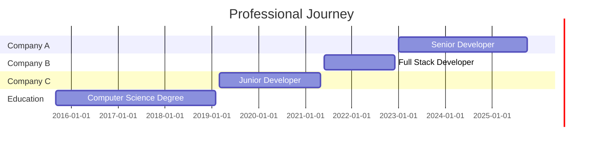

<div align="center">

<!-- ANIMATED TYPING HEADER -->
[](https://git.io/typing-svg)

<!-- SOCIAL MEDIA BADGES -->
[](https://linkedin.com/in/YOUR_LINKEDIN)
[](https://twitter.com/YOUR_TWITTER)
[](https://YOUR_PORTFOLIO_URL)
[](mailto:YOUR_EMAIL)

<!-- VISITOR COUNTER -->


</div>

---

## 👨‍💻 About Me

```typescript
const YOUR_NAME = {
    pronouns: "He" | "Him",
    location: "YOUR_CITY, YOUR_COUNTRY",
    code: ["TypeScript", "JavaScript", "Python", "Java", "Go", "Rust"],
    askMeAbout: ["web dev", "cloud architecture", "AI/ML", "open source"],
    technologies: {
        frontEnd: {
            js: ["React", "Next.js", "Vue", "Angular"],
            css: ["Tailwind", "Bootstrap", "Material UI", "Styled Components"]
        },
        backEnd: {
            js: ["Node.js", "Express", "Nest.js"],
            python: ["Django", "FastAPI", "Flask"],
            misc: ["Spring Boot", "GraphQL", "REST APIs"]
        },
        databases: ["MongoDB", "PostgreSQL", "MySQL", "Redis", "Firebase"],
        devOps: ["Docker", "Kubernetes", "AWS", "GCP", "Azure", "CI/CD"],
        tools: ["Git", "VS Code", "Postman", "Figma", "Linux"]
    },
    currentFocus: "Building scalable cloud-native applications",
    funFact: "I debug code in my dreams 🌙"
};
```

---

## 🛠️ Tech Stack

### 💻 Languages


### 🎨 Frontend


### ⚙️ Backend


### 🗄️ Databases


### ☁️ Cloud & DevOps


### 🤖 AI/ML


---

## 📊 GitHub Statistics

<div align="center">

<!-- GITHUB STATS CARD -->


<!-- GITHUB STREAK STATS -->


</div>

<div align="center">

<!-- TOP LANGUAGES -->


</div>

<!-- GITHUB TROPHY -->
<div align="center">

[](https://github.com/ryo-ma/github-profile-trophy)

</div>

<!-- CONTRIBUTION ACTIVITY GRAPH -->
<div align="center">

[](https://github.com/ashutosh00710/github-readme-activity-graph)

</div>

---

## 🎯 Current Focus

```yaml
🔭 Working on: Building a cloud-native microservices platform
🌱 Learning: Rust, System Design, Distributed Systems
👯 Looking to collaborate on: Open source projects
💬 Ask me about: Full-stack development, Cloud Architecture, DevOps
⚡ Fun fact: I've contributed to 50+ open source projects
```

---

## 📝 Latest Blog Posts

<!-- BLOG-POST-LIST:START -->
<!-- This section will be auto-updated by GitHub Actions -->
<!-- See GITHUB-ACTIONS-GUIDE.md for setup instructions -->
- [Your Latest Blog Post Title](https://yourblog.com/post1)
- [Another Great Article](https://yourblog.com/post2)
- [Tutorial on Advanced Topics](https://yourblog.com/post3)
<!-- BLOG-POST-LIST:END -->

➡️ [More blog posts...](https://YOUR_BLOG_URL)

---

<!-- OPTIONAL: Medium Articles Section -->
<!-- Uncomment this section if you write on Medium -->
<!--
## ✍️ Latest on Medium

<!-- MEDIUM-POST-LIST:START -->
<!-- MEDIUM-POST-LIST:END -->

➡️ [Read more on Medium](https://medium.com/@YOUR_MEDIUM)

---
-->

---

## 🚀 Featured Projects

<div align="center">

<!-- PROJECT 1 -->
[](https://github.com/YOUR_USERNAME/PROJECT_1)

<!-- PROJECT 2 -->
[](https://github.com/YOUR_USERNAME/PROJECT_2)

<!-- PROJECT 3 -->
[](https://github.com/YOUR_USERNAME/PROJECT_3)

<!-- PROJECT 4 -->
[](https://github.com/YOUR_USERNAME/PROJECT_4)

</div>

---

## 🎵 Spotify Now Playing (Optional)

<div align="center">

[](https://open.spotify.com/user/YOUR_SPOTIFY_USER)

</div>

---

## 💼 Work Experience

<!-- OPTION 1: Visual Timeline (Mermaid Gantt Chart) -->


<!-- OPTION 2: Detailed Experience with GitHub Links -->
<!-- Uncomment and customize this section for more detailed work experience -->
<!--
### 🏢 Senior Developer @ Company A
**📅 January 2023 - Present** | **📍 City, Country**

Leading development of [brief description of work].

**Key Achievements:**
- 🚀 Achievement 1 (with metrics if possible)
- 📊 Achievement 2
- 👥 Achievement 3

**Technologies:** List, Your, Tech, Stack

**Related GitHub Projects:**
- [project-name](https://github.com/YOUR_USERNAME/project-name) - Description ⭐ X stars

---

### 🏢 Full Stack Developer @ Company B
**📅 June 2021 - December 2022** | **📍 City, Country**

[Brief description of role and responsibilities]

**Key Achievements:**
- ✨ Achievement 1
- 🎯 Achievement 2

**Technologies:** List, Your, Tech, Stack

**Related GitHub Projects:**
- [project-name](https://github.com/YOUR_USERNAME/project-name) - Description ⭐ X stars

---
-->

<!-- OPTION 3: Compact Format with Company Badges -->
<!-- Uncomment for a badge-based compact experience section -->
<!--
### Current

[](https://companywebsite.com)
**Senior Developer** • 2023 - Present

### Previous

[](https://companywebsite.com)
**Full Stack Developer** • 2021 - 2022

[](https://companywebsite.com)
**Junior Developer** • 2019 - 2021

### Education

[](https://university.edu)
**Computer Science Degree** • 2019

See BADGE-REFERENCE.md for company badge examples
-->

---

## 🏆 Achievements

- 🌟 **50+** Open Source Contributions
- ⭐ **10,000+** GitHub Stars across repositories
- 📝 **100+** Technical Articles Published
- 🎤 **15+** Technical Talks & Conference Presentations
- 🏅 **Top Contributor** to [Project Name]
- 🎓 **AWS Certified Solutions Architect**
- 💡 **Google Developer Expert** in Web Technologies

---

## 📫 How to Reach Me

<div align="center">

[](https://linkedin.com/in/YOUR_LINKEDIN)
[](https://twitter.com/YOUR_TWITTER)
[](https://github.com/YOUR_USERNAME)
[](https://YOUR_PORTFOLIO_URL)
[](https://dev.to/YOUR_DEVTO)
[](https://medium.com/@YOUR_MEDIUM)
[](mailto:YOUR_EMAIL)

</div>

---

## 💖 Support My Work

<div align="center">

If you like my work, consider supporting me:

[](https://www.buymeacoffee.com/YOUR_USERNAME)
[](https://ko-fi.com/YOUR_USERNAME)
[](https://paypal.me/YOUR_USERNAME)
[](https://github.com/sponsors/YOUR_USERNAME)

</div>

---

## 🐍 Contribution Snake Animation

<div align="center">


</div>

---

<div align="center">

### 💭 Quote of the Day


### 😄 Random Dev Joke


---

<!-- OPTIONAL: Track Your Profile Impact -->
<!-- Uncomment to add impact tracking section -->
<!--
## 📊 Profile Impact Tracking

Want to measure the impact of your optimized profile?

**Baseline Recorded:** [DATE]

**Current Stats:**
- Profile Views: [TRACK WEEKLY]
- Followers: [TRACK WEEKLY]
- Job Opportunities: [TRACK MONTHLY]

See SETUP-GUIDE.md → "Measurement & Impact Tracking" section for:
- How to track visibility and credibility metrics
- Proving the hypothesis that profile optimization works
- Expected growth timelines
- Tools for automated tracking

**Goal:** Prove or disprove that an optimized GitHub profile improves visibility and credibility!

---
-->

⭐️ From [YOUR_USERNAME](https://github.com/YOUR_USERNAME) | Made with ❤️ and ☕

**Thanks for visiting! Let's connect and build something amazing together! 🚀**

</div>
